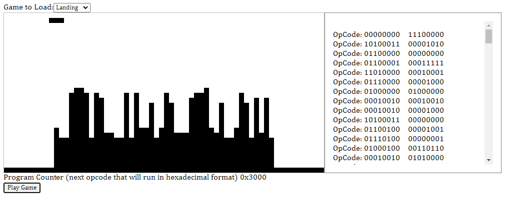

# Chip-8 Emulator 
This is a common emulator people build when learning how emulators work. This one is built using vanilla javascript with a lot of comments added to help me understand things as I was building it out. Most of the code originally came from https://www.freecodecamp.org/news/creating-your-very-own-chip-8-emulator/

Some important concept that you learn through building this:
- Reading in binary data into javascript
- Working more with bitwise operations to help move around all those 0s and 1s
- What an "opcode" is for an emulator, and how to use a specification to help know what to build
- Seeing the parallel with the code you are writing, and assembly instructions that parity the operations
- How to use the canvas to build out a custom display

